# Project Overview
## Data Carpentry - Assignment 2
#### by Jack Toke

# Introduction

This project is a data pipeline for transforming and loading data as a part of Data Carpentry (IFQ718).
The object of the project is to find answers to three specific questions.
1. Are there periods of the year, where some businesses are more profitable?
2. Which customers were most loyal for each business?
3. What is the employee turnover rate of each business?

# Pipeline Architecture
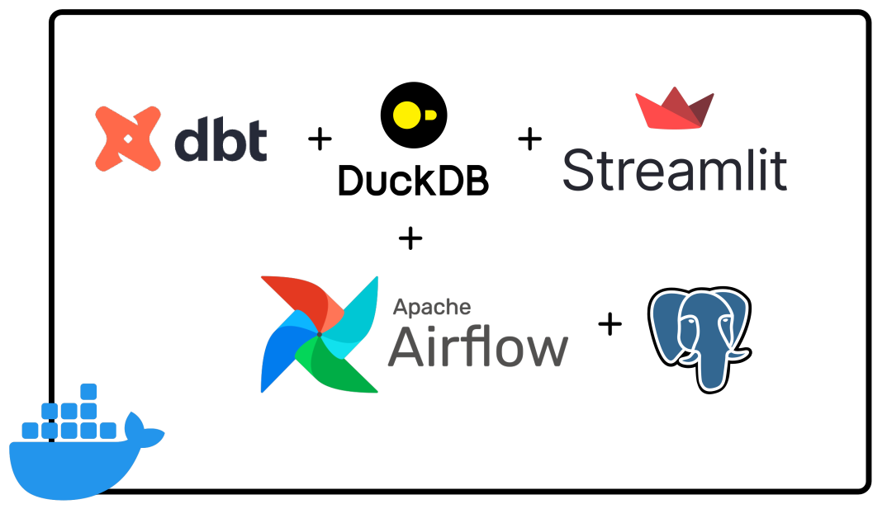
The project integrates **Apache Airflow**, **dbt**, **Streamlit** and **DuckDB** to run on **Docker**.
It is meant to be portable and doesn't need any other services.

# How to get up and running?
1. First you will need Docker installed on your system.
2. Clone the repo
3. Once you have cd into the directory where you have persisted the repository, setup the **Python** virtual environment.
`python -m .venv 3.12`.  Then you will have activate your **Python** virtual environment by running `source .venv/bin/activate`.
4. You will also need to install the required dependencies by running `pip install -r requirements.txt`.
5. Finally, you can run `docker compose up`.  You can visit `localhost:8080` to access the **Airflow** dashboard, 
where you can run all your dags that transform and load the **JSON** files provided.  The files are located in `./data/receipts/*`.
6. To see the visual you can visit `localhost:8505`.

# Airflow
Once, your docker is up and running, visit `localhost:8080` on your browser and you will be greeted by the following login screen.
The default username and password is `airflow` for both the username and password.

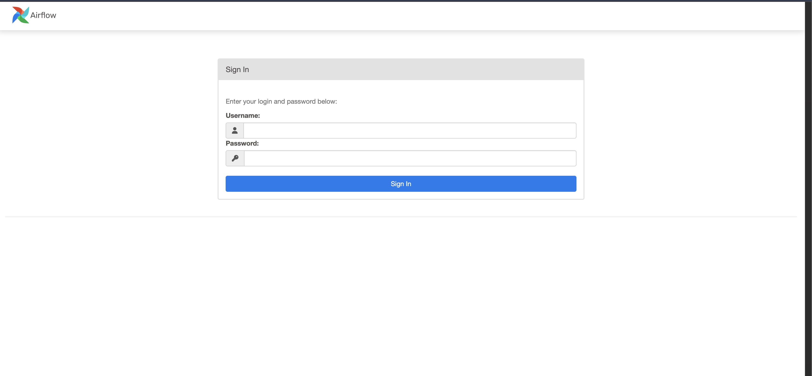

Once you are logged in your will see the following screen.
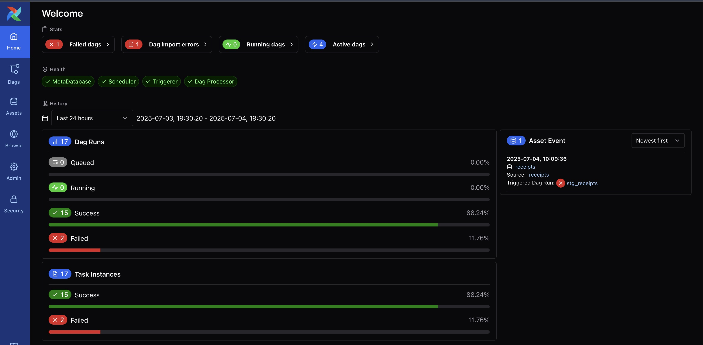
Click on the **Dags** icon on the left of the screen and you will be greeted by the following screen.
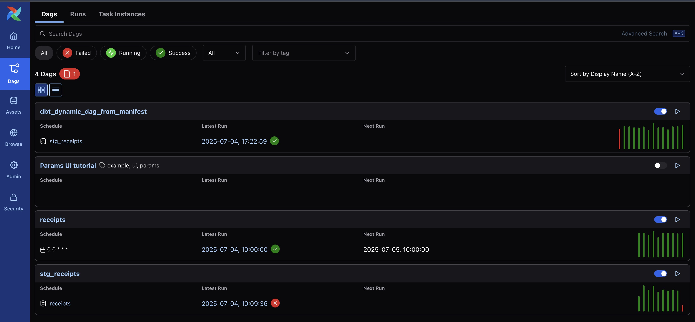
The first dag that will trigger the rest of the extraction and loading tasks is `receipts`.  Click the `play` button 
on the right and it wil run the rest of the dags.  Once everything runs successfully, you can go to the `Streamlit` page 
to see the analysis and thought process.

# Streamlit
Visit `http://localhost:8505/` and it will take you the website.  There are just three links and the conclusion 
and analysis are at the bottom of each page.

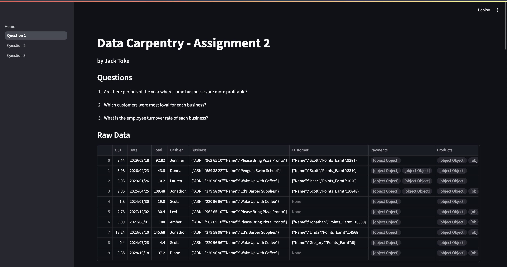

# Question 1 - Are there periods of the year where some businesses are more profitable?
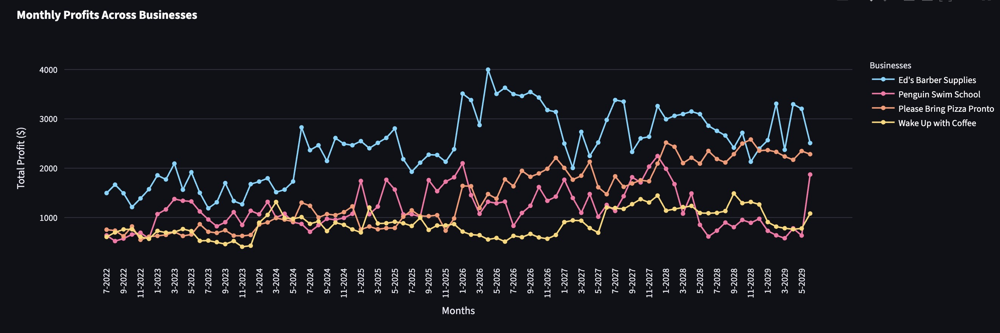

## Answer:
1. **Ed's Barber Supplies** is doing well year by year, and it is **performing especially well during the first five months of the year.
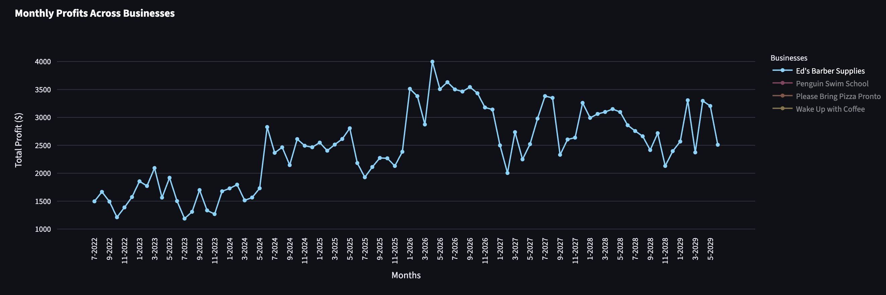
2. **Please Bring Pizza Pronto** is performing really well across the year, and it is growing and doubling its profit every two years. However, it does look like its performance at the end of each year is slightly weaker than the rest of the year.
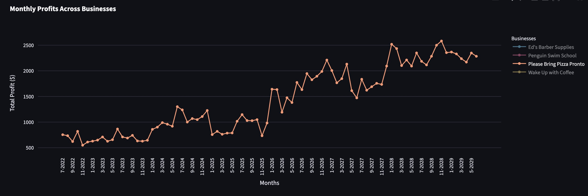
3. **Penguin Swim School** performs worse in the middle of the year, which happens to be winter in Australia.  The business growth is sporadic and its overall trajectory is flat, which is to say, the business is not very stable and the growth is rather weak.
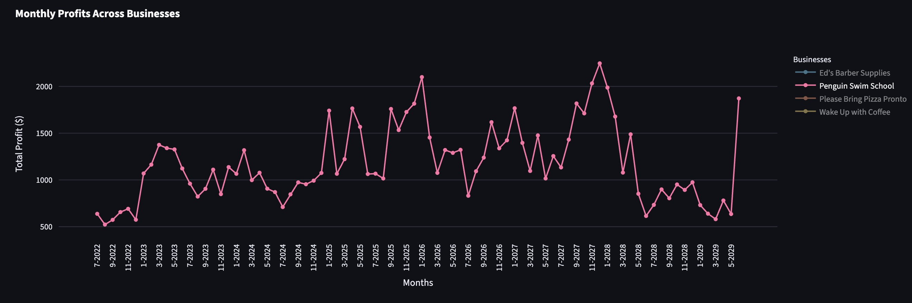
4. Wake Up with Coffee's business performance is weak with minimum growth compared to Ed's Barber Supplies and Please Bring Pizza Pronto,however, but it doesn't fluctuate as much as Penguin Swim School.  The business goes up and down but the pattern is not very clear and probably requires further investigation. 
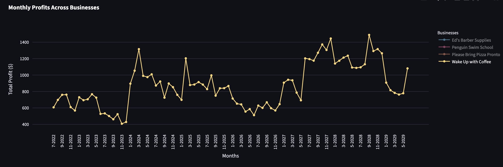

# Q2 - Which customers were most loyal for each business?
Let's start by defining what **loyal customer** is.  A loyal customer could be someone who spends the most at a business.
If you are small business or mum and dad's shop down the street, could be someone who visit your venue or use your service regularly.
However, for this exercise, we are going to say, **loyal customers** are those that spend the most at your business or 
make the most number of purchases.

## Top 10 Customers by Amount Spent
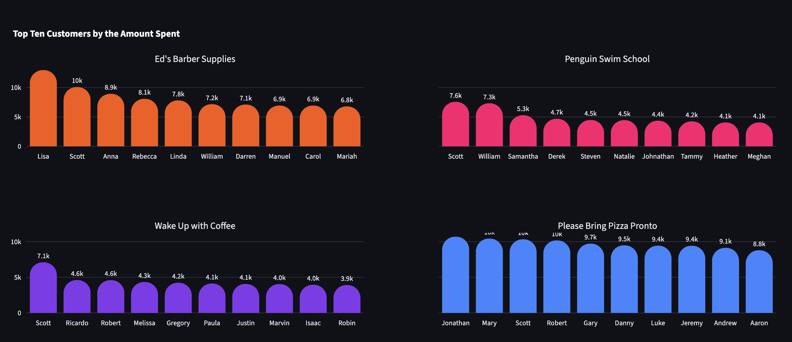
If this is our definition of loyal customer then the most loyal customers of each businesses are as follows:
1. **Ed's Barber Supplies** 1.
   1. Lisa - $12,964
   2. Scott - $10,086
   3. Anna - $8,936
2. **Penguin Swim School**
   1. Scott - $7,570
   2. William - $7,320
   3. Samantha - $5,283
3. **Wake Up with Coffee**
   1. Scott - $7,098
   2. Ricardo - $4,609
   3. Robert - $4,596
4. **Please Bring Pizza Pronto**
   1. Jonathan - $10,686
   2. Mary - $10,425
   3. Scott - $10,324

## Top 10 Customers by Number of Purchases
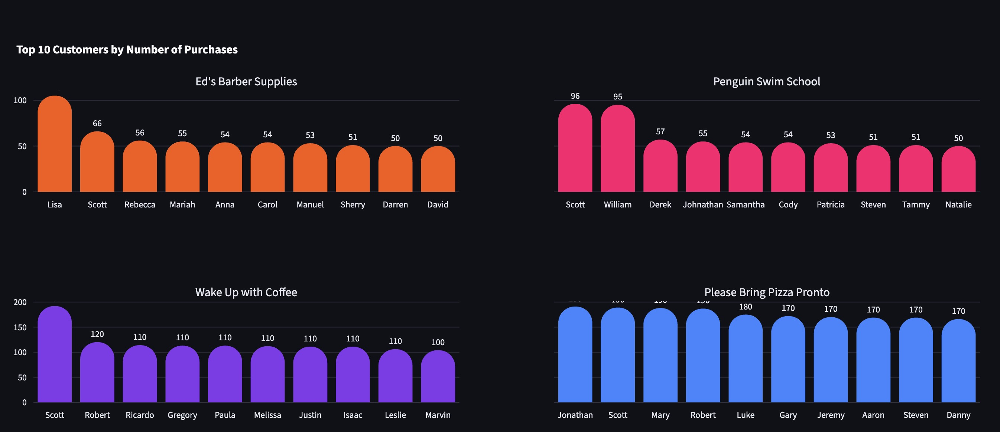

1. **Ed's Barber Supplies**
   1. Lisa - 105
   2. Scott - 66
   3. Anna - 56
2. **Penguin Swim School**
   1. Scott - 96
   2. William - 95
   3. Samantha - 57
3. **Wake Up with Coffee**
   1. Scott - 192
   2. Ricardo - 120
   3. Robert - 110
4. **Please Bring Pizza Pronto**
   1. Jonathan - 191
   2. Mary - 189
   3. Scott - 188

# Q3 - What is the employee turnover rate of each business?
I have determined that the employee turnover rate is calculated as follows:
#### Turnover rate = (# employee left in a period/# avg. employee over a period) * 100%

